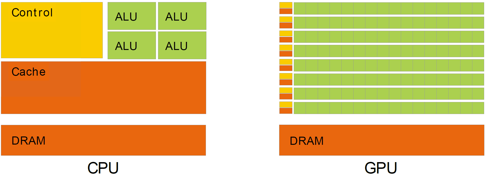
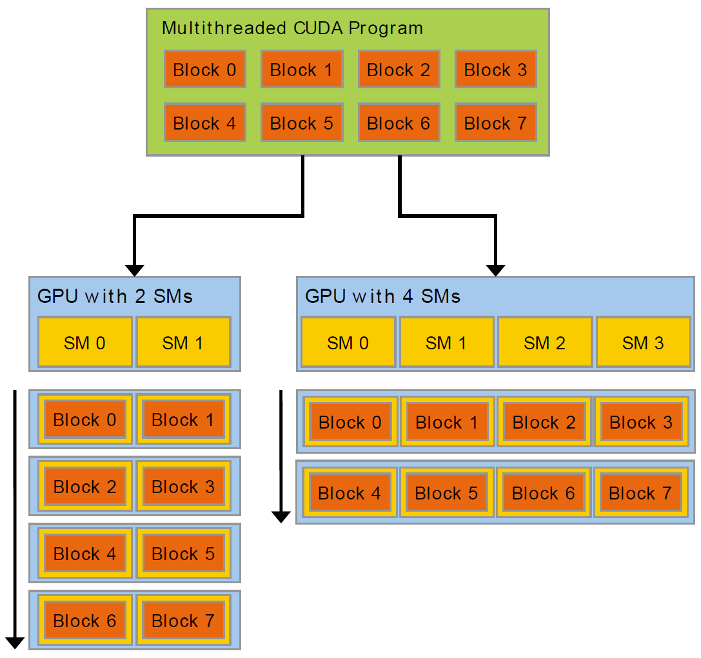

# 1. 简介
## 1.1 图像处理到通用并行计算的演变
```
Driven by the insatiable market demand for realtime, high-definition 3D graphics,
the programmable Graphic Processor Unit or GPU has evolved into a highly parallel,
multithreaded, manycore processor with tremendous computational horsepower and
very high memory bandwidth, as illustrated by Figure 1 and Figure 2.
```
市场对实时的、高精度的三维图形的需求是无法满足的，在这种需求的推动下，可编程图形处理器（GPU)已演变成高并行度、多线程的多核处理器，同时具有强大的计算能力和极高的存储器带宽，如图1和2所示：

图1. CPU和GPU的每秒浮点运算能力对比


图2. CPU和GPU的存储器带宽对比

```
The reason behind the discrepancy in floating-point capability between the CPU and the
GPU is that the GPU is specialized for compute-intensive, highly parallel computation
- exactly what graphics rendering is about - and therefore designed such that more
transistors are devoted to data processing rather than data caching and flow control, as
schematically illustrated by Figure 3.
```
造成CPU和GPU之间浮点运算能力的差距的原因在于，GPU是针对高计算密度和高并行化的场景设计的，图形渲染就属于这一类型，这样就有更多的晶体管用来做数据处理而不是数据的缓存和流控，如图3所示

图3. GPU上更多的晶体管用于数据处理

```
More specifically, the GPU is especially well-suited to address problems that can be
expressed as data-parallel computations - the same program is executed on many data
elements in parallel - with high arithmetic intensity - the ratio of arithmetic operations to memory operations. Because the same program is executed for each data element, there is a lower requirement for sophisticated flow control, and because it is executed on many data elements and has high arithmetic intensity, the memory access latency can be hidden with calculations instead of big data caches.
```
具体来说，GPU非常适合于解决一些可以被抽象成data parallel的计算问题，即并行地对多个数据单元做相同的高计算密度（计算操作/存储器操作）的操作。由于在每个数据元素上执行同样的程序，我们就不需要复杂的流控，并且由于在大量的数据元素上同时执行并且计算密度高，存储器访问的latency可以通过大量的计算隐藏而无需使用大的cache。（译者注：在大量的计算的同时，下一步使用的数据可以提前准备，在真正使用数据的时候已经准备好，看起来像读取数据的过程被隐藏了）

```
Data-parallel processing maps data elements to parallel processing threads. Many
applications that process large data sets can use a data-parallel programming model
to speed up the computations. In 3D rendering, large sets of pixels and vertices are
mapped to parallel threads. Similarly, image and media processing applications such as
post-processing of rendered images, video encoding and decoding, image scaling, stereo
vision, and pattern recognition can map image blocks and pixels to parallel processing
threads. In fact, many algorithms outside the field of image rendering and processing
are accelerated by data-parallel processing, from general signal processing or physics
simulation to computational finance or computational biology.
```
Data parallel过程将数据元素映射到并行处理的线程Thread上。通常需要处理大数据集的程序都可使用data-parallel的编程模型来加速计算。在三维图形渲染中，像素和顶点通常被映射到并行的thread上。类似的，在图像渲染后处理、视频编解码、图像缩放、立体视觉和模式识别等图像和多媒体处理应用中，可以把图像块和像素映射到并行处理的线程上。事实上，data-parallel不仅用于图像渲染和处理的加速，还广泛应用于信号处理、物理仿真、计算金融和计算生物学中。

## 1.2 CUDA: 一种通用并行计算平台和编程模型
```
In November 2006, NVIDIA introduced CUDA®, a general purpose parallel computing
platform and programming model that leverages the parallel compute engine in
NVIDIA GPUs to solve many complex computational problems in a more efficient way
than on a CPU.
```
NVIDIA在2016年11月发布了CUDA®，将其定义为一种通用并行计算平台和编程模型。相比于CPU，CUDA利用NVIDIA GPU中的并行计算引擎来更高效地解决复杂的计算问题。

```
CUDA comes with a software environment that allows developers to use C as a highlevel
programming language. As illustrated by Figure 4, other languages, application
programming interfaces, or directives-based approaches are supported, such as
FORTRAN, DirectCompute, OpenACC.
```
CUDA提供了允许开发者使用C作为编程语言的的软件环境。如图4所示，其他语言、应用编程接口（API）或者编译制导（directive-based）的方法都有所支持，例如FORTRAN，DirectCompute和OpenACC。

图4. GPU计算应用

CUDA设计的初衷是支持多种语言和API


## 1.3 一种可扩展的编程模型
```
The advent of multicore CPUs and manycore GPUs means that mainstream processor
chips are now parallel systems. Furthermore, their parallelism continues to scale
with Moore's law. The challenge is to develop application software that transparently
scales its parallelism to leverage the increasing number of processor cores, much as
3D graphics applications transparently scale their parallelism to manycore GPUs with
widely varying numbers of cores.
```
多核CPU和众核GPU的出现，意味着现在的主流处理器芯片已经是并行系统。此外，他们的并行度将继续以摩尔定律扩展。当前的挑战是开发可以透明地扩展并行度的软件，以利用数量上不断增加的处理器核心，类似三维图像应用可以在不同核心数的GPU上透明地扩展并行度。

```
The CUDA parallel programming model is designed to overcome this challenge while
maintaining a low learning curve for programmers familiar with standard programming
languages such as C.
```
CUDA并行模型的设计理念就是为了克服这样的挑战。并且对于熟悉传统编程语言譬如C的开发人员，能够保持一个相对不陡峭的学习曲线。

```
At its core are three key abstractions - a hierarchy of thread groups, shared memories,
and barrier synchronization - that are simply exposed to the programmer as a minimal
set of language extensions.
```
CUDA的核心是三种关键的抽象：thread group（线程组）的层次，shared memories（共享内存） 和 barrier synchronization（栅栏同步）。这是呈现给程序员的最小的语言扩展集。

```
These abstractions provide fine-grained data parallelism and thread parallelism,
nested within coarse-grained data parallelism and task parallelism. They guide the
programmer to partition the problem into coarse sub-problems that can be solved
independently in parallel by blocks of threads, and each sub-problem into finer pieces
that can be solved cooperatively in parallel by all threads within the block.
```
这些抽象提供了细粒度的data parallelism 和 thread parallelism（线程并行），嵌套在粗粒度的data parallelism和task parallelism（任务并行）中。它指导程序员将问题分成多个粗粒度的子问题，然后通过多个线程块（thread block）并行地解决这些子问题。而对于每个子问题来说，将其分解成更细粒度的操作，从而可以用block内的多个thread相互协作地并行处理。

```
This decomposition preserves language expressivity by allowing threads to cooperate
when solving each sub-problem, and at the same time enables automatic scalability.
Indeed, each block of threads can be scheduled on any of the available multiprocessors
within a GPU, in any order, concurrently or sequentially, so that a compiled CUDA
program can execute on any number of multiprocessors as illustrated by Figure 5, and
only the runtime system needs to know the physical multiprocessor count.
```
这种分解通过允许多个thread可以协作处理子问题从而保留了语言的表达性，同时还能实现自动扩展。实际上，每个thread block可以以任何的顺序、并行或串行地被调度在GPU上任何一个可能的多处理器上（multiprocessor）上，这就使得一个编译得到的CUDA程序可以在任何数量的multiprocessor上执行，如图5所示，只有运行时(Runtime)系统需要知道处理器物理multiprocessor数。

图5. 自动扩展性

```
This scalable programming model allows the GPU architecture to span a wide market
range by simply scaling the number of multiprocessors and memory partitions: from
the high-performance enthusiast GeForce GPUs and professional Quadro and Tesla
computing products to a variety of inexpensive, mainstream GeForce GPUs (see CUDAEnabled
GPUs for a list of all CUDA-enabled GPUs).
```
这种可扩展的编程模型使得GPU架构可以通过简单地调整multiprocessor数和存储器分区，延展到不同的市场范围：面向高性能发烧友的GeForce显卡，专业级的Quadro和Tesla计算卡；面向主流市场的平价GeForce显卡。（详见支持CUDA的GPU列表[link]）

```
A GPU is built around an array of Streaming Multiprocessors (SMs) (see Hardware
Implementation for more details). A multithreaded program is partitioned into blocks
of threads that execute independently from each other, so that a GPU with more
multiprocessors will automatically execute the program in less time than a GPU with
fewer multiprocessors.
```
GPU是围绕着流多处理器（Streaming Multiprocessors， SMs）设计制造的。一个多线程的程序被分解到各个线程块独立执行，因此拥有更多SM的GPU可以在更短的时间内完成程序的执行。

## 1.4 文档结构
```
This document is organized into the following chapters:
‣ Chapter Introduction is a general introduction to CUDA.
‣ Chapter Programming Model outlines the CUDA programming model.
‣ Chapter Programming Interface describes the programming interface.
‣ Chapter Hardware Implementation describes the hardware implementation.
‣ Chapter Performance Guidelines gives some guidance on how to achieve maximum
performance.
‣ Appendix CUDA-Enabled GPUs lists all CUDA-enabled devices.
‣ Appendix C Language Extensions is a detailed description of all extensions to the C
language.
‣ Appendix Cooperative Groups describes synchronization primitives for various
groups of CUDA threads.
‣ Appendix CUDA Dynamic Parallelism describes how to launch and synchronize
one kernel from another.
‣ Appendix Mathematical Functions lists the mathematical functions supported in
CUDA.
‣ Appendix C/C++ Language Support lists the C++ features supported in device code.
‣ Appendix Texture Fetching gives more details on texture fetching
‣ Appendix Compute Capabilities gives the technical specifications of various devices,
as well as more architectural details.
‣ Appendix Driver API introduces the low-level driver API.
‣ Appendix CUDA Environment Variables lists all the CUDA environment variables.
‣ Appendix Unified Memory Programming introduces the Unified Memory
programming model.
```
本篇文档按如下章节组织：
- 第一章，简介，介绍CUDA
- 第二章，编程模型，概述编程模型
- 第三章，编程接口，介绍编程接口
- 第四章，硬件实现，介绍硬件实现
- 第五章，性能指南，给出一些实现最佳性能的建议
- 附录，支持CUDA的GPU，列出了所有支持CUDA的GPU
- 附录，C语言扩展，详细介绍了所有的C语言扩展
- 附录，Cooprative Groups，介绍CUDA thread各种group的同步原语
- 附录，CUDA Dynamic Parallelism，介绍了如何从另一个kernel中启动以及同步一个kernel
- 附录，数学函数，列出了CUDA支持的数学函数
- 附录，C/C++语言扩展，列出了device端代码支持的C++特性
- 附录，Texture获取，给出了texture获取的细节
- 附录，计算能力，给出了各种设备的技术规范和更多架构细节
- 附录，驱动API，介绍底层驱动API
- 附录，CUDA环境变量，列出了所有CUDA相关的环境变量
- 附录，Unified Memory编程，介绍了unified memory编程模型