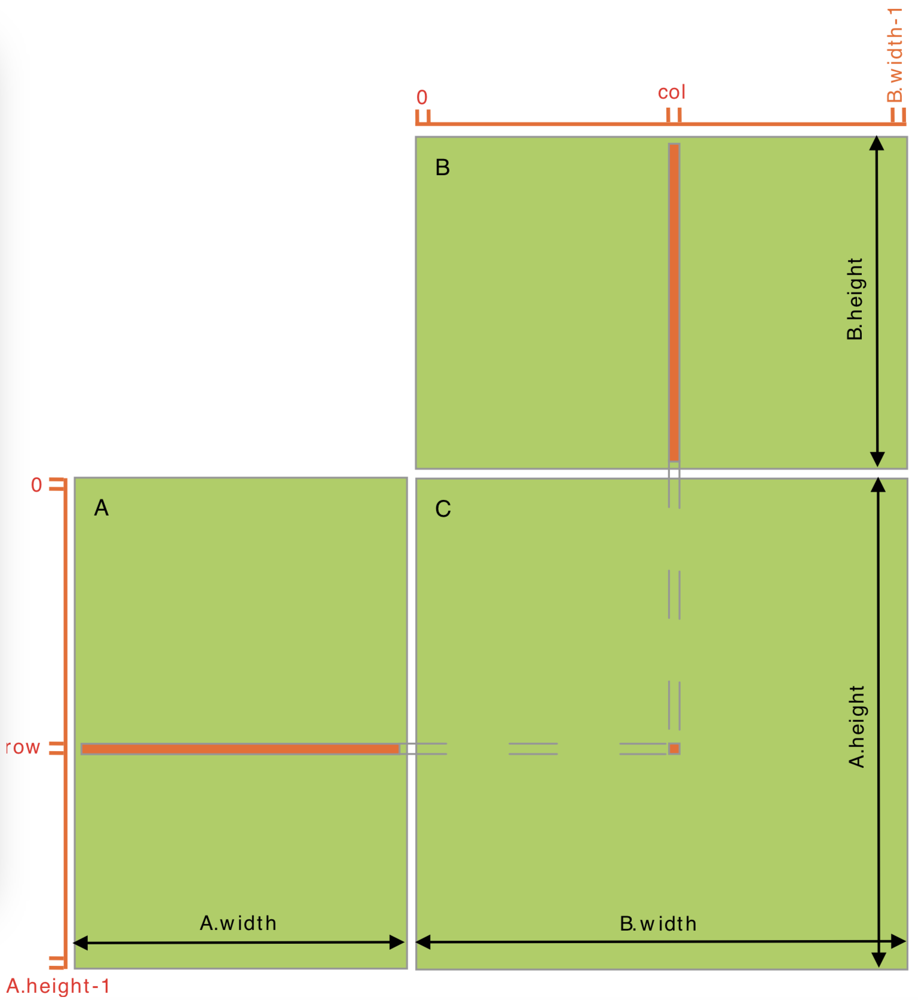
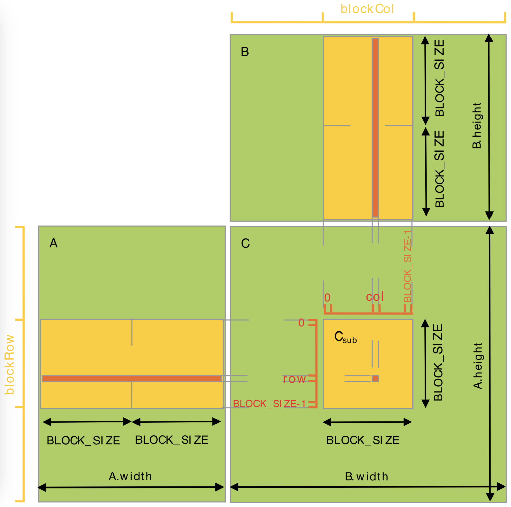

## 3.2 CUDA C运行时
```
The runtime is implemented in the cudart library, which is linked to the application, either statically via cudart.lib or libcudart.a, or dynamically via cudart.dll or libcudart.so. Applications that require cudart.dll and/or cudart.so for dynamic linking typically include them as part of the application installation package.
All its entry points are prefixed with cuda.
As mentioned in Heterogeneous Programming, the CUDA programming model assumes a system composed of a host and a device, each with their own separate memory. Device Memory gives an overview of the runtime functions used to manage device memory.
Shared Memory illustrates the use of shared memory, introduced in Thread Hierarchy, to maximize performance.
Page-Locked Host Memory introduces page-locked host memory that is required to overlap kernel execution with data transfers between host and device memory.
Asynchronous Concurrent Execution describes the concepts and API used to enable asynchronous concurrent execution at various levels in the system.
Multi-Device System shows how the programming model extends to a system with multiple devices attached to the same host.
Error Checking describes how to properly check the errors generated by the runtime.
Call Stack mentions the runtime functions used to manage the CUDA C call stack.
Texture and Surface Memory presents the texture and surface memory spaces that provide another way to access device memory; they also expose a subset of the GPU texturing hardware.
Graphics Interoperability introduces the various functions the runtime provides to interoperate with the two main graphics APIs, OpenGL and Direct3D.
```
**cudart**动态库是运行时的实现，它通过**cudart.lib**或者**libcudart.a**静态地链接到应用程序，或者通过**cudart.dll**或**libcudart.so**动态地连接到应用程序。需要动态链接**cudart.dll**或者**cudart.so**库的应用程序一般会把它们作为安装包的一部分。所有函数的前缀都是**cuda**。  
如2.4异构编程所述，cuda编程模型假设系统包含主机和设备，它们都有各自独立的内存，3.22节（设备内存）给出了操作设备内存的函数简介。  
3.2.3 共享内存描述了如何使用共享内存（在2.2节中提及）以实现性能最大化。  
3.2.4 分页锁定主机内存介绍了分页锁定主机内存， 它可以使内核执行和主机设备间数据传输并发进行。  
3.2.5 异步并发执行描述了支持系统中不同层次的异步并发执行的概念和API。  
3.2.6 多设备系统展示了编程模型如何扩展到多设备的主机系统。  
3.2.9 错误检查描述了如何恰当地检查运行时产生的错误  
3.2.10 栈的调用描述了运行时函数如何操作cuda C 的栈调用  
3.2.11 纹理内存和表面内存陈述了纹理内存和空间内存，它们提供了另一种访问设备内存的方式，他们是GPU纹理硬件的一个子集。  
3.2.12 图形互操作能力介绍了不同的运行时函数用以和两个主要图形API OpenGL和Direct3D进行互操作。

### 3.2.1 初始化
```
There is no explicit initialization function for the runtime; it initializes the first time a runtime function is called (more specifically any function other than functions from the device and version management sections of the reference manual). One needs to keep this in mind when timing runtime function calls and when interpreting the error code from the first call into the runtime.
```
运行时没有显示的初始化函数，他在初次调用运行时函数时完成初始化（更精确来说，参考手册和设备和版本管理部分节中没有提及初始化函数）。在统计函数运行时间和在解析初次调用运行时产生的错误编码时必须牢记这点。

```
During initialization, the runtime creates a CUDA context for each device in the system (see Context for more details on CUDA contexts). This context is the primary context for this device and it is shared among all the host threads of the application. As part of this context creation, the device code is just-in-time compiled if necessary (see Just-in-Time Compilation) and loaded into device memory. This all happens under the hood and the runtime does not expose the primary context to the application.
```
在初始化时，运行时为系统中的每个设备创建一个cuda上下文（I.1提供了上下文的更多细节），这个上下文是设备的主要上下文，它被应用的所有主机线程共享。作为上下文创建的一部分，设备代码都是在需要时被即时编译并载入设备内存。这些都是隐式发生的，运行时没有必要把主上下文展示给应用。

```
When a host thread calls cudaDeviceReset(), this destroys the primary context of the device the host thread currently operates on (i.e., the current device as defined in Device Selection). The next runtime function call made by any host thread that has this device as current will create a new primary context for this device.
```
当主机线程调用 **cudaDeviceReset()** 时，这销毁了主机线程当前操作设备的主要上下文（比如说在Device Selection中选择的的当前设备）。任何以这个设备为当前设备的主机线程在调用运行时函数时会为这个设重建一个主要上下文。

###3.2.2 设备内存
```
As mentioned in Heterogeneous Programming, the CUDA programming model assumes a system composed of a host and a device, each with their own separate memory. Kernels operate out of device memory, so the runtime provides functions to allocate, deallocate, and copy device memory, as well as transfer data between host memory and device memory.
```
正如异构编程章节里提到的，cuda编程模型假定系统包含主机和设备，它们各自拥有自己独立的内存。内核函数不能操作设备内存，所以运行时提供了分配，释放，和拷贝，以及设备内存和主机内存间数据传输的函数。

```
Device memory can be allocated either as linear memory or as CUDA arrays.
CUDA arrays are opaque memory layouts optimized for texture fetching. They are
described in Texture and Surface Memory.
```
设备内存能够被分配为线性内存或cuda数组。

cuda数组是不透明的内存布局，为纹理获取做了优化，具体的细节在3.2.11中描述。

```
Linear memory exists on the device in a 40-bit address space, so separately allocated
entities can reference one another via pointers, for example, in a binary tree.
```
线性内存存在于40位地址空间内， 所以独立分配的内存空间可以通过指针相互应用，比如说，二叉树。

```
Linear memory is typically allocated using cudaMalloc() and freed using cudaFree() and data transfer between host memory and device memory are typically done using cudaMemcpy(). In the vector addition code sample of Kernels, the vectors need to be copied from host memory to device memory:
```
线性内存一般通过 **cudaMalloc()** 分配，通过 **cudaFree()** 释放，主机和设备之间的数据传输通过 **cudaMemcpy()**。在如下实现向量加法的核函数示例中，向量需要从主机内存拷贝到设备内存中。
```C
// Device code
__global__ void VecAdd(float* A, float* B, float* C, int N)
{
    int i = blockDim.x * blockIdx.x + threadIdx.x;
    if (i < N)
        C[i] = A[i] + B[i];
}
// Host code
int main() {
    int N = ...;
    size_t size = N * sizeof(float);

    // Allocate input vectors h_A and h_B in host memory
    float* h_A = (float*)malloc(size);
    float* h_B = (float*)malloc(size);

    // Initialize input vectors
    ...

    // Allocate vectors in device memory
    float* d_A;
    cudaMalloc(&d_A, size);
    float* d_B;
    cudaMalloc(&d_B, size);
    float* d_C;
    cudaMalloc(&d_C, size);

    // Copy vectors from host memory to device memory
    cudaMemcpy(d_A, h_A, size, cudaMemcpyHostToDevice);
    cudaMemcpy(d_B, h_B, size, cudaMemcpyHostToDevice);
    
    // Invoke kernel
    int threadsPerBlock = 256;
    int blocksPerGrid =
            (N + threadsPerBlock – 1) / threadsPerBlock;
    VecAdd<<<blocksPerGrid, threadsPerBlock>>>(d_A, d_B, d_C, N);

    // Copy result from device memory to host memory
    // h_C contains the result in host memory
    cudaMemcpy(h_C, d_C, size, cudaMemcpyDeviceToHost);
    
    // Free device memory
    cudaFree(d_A);
    cudaFree(d_B);
    cudaFree(d_C);
    
    // Free host memory
    ...
}
```
```
Linear memory can also be allocated through cudaMallocPitch() and cudaMalloc3D(). These functions are recommended for allocations of 2D or 3D
arrays as it makes sure that the allocation is appropriately padded to meet the alignment requirements described in Device Memory Accesses, therefore ensuring best performance when accessing the row addresses or performing copies between 2D arrays and other regions of device memory (using the cudaMemcpy2D() and cudaMemcpy3D() functions). The returned pitch (or stride) must be used to access array elements. The following code sample allocates a width x height 2D array of floating-point values and shows how to loop over the array elements in device code:
```
线性内存也可以通过 **cudaMallocPitch()** 和 **cudaMalloc3D()** 分配。但是推荐用这两个函数分配2D或者3D数组，因为它能保证分配的空间通过填充满足5.3.2（设备内存访问）中描述的内存对齐要求，以保证在按行访问、二维数组拷贝、其他维度的设备内存操作中（用 **cudaMemcpy2D()** 和 **cudaMemcpy3D()** ）的最佳性能。在访问数组元素时必须使用返回的步长（ptich）。下面的示例代码分配了一个空间为**Width\*height**的二维浮点数组，同时演示了如何在设备代码遍历数组元素：
```C
// Host code
int width = 64, height = 64;
float* devPtr;
size_t pitch;
cudaMallocPitch(&devPtr, &pitch,
                width * sizeof(float), height);
MyKernel<<<100, 512>>>(devPtr, pitch, width, height);

// Device code
__global__ void MyKernel(float* devPtr,
                         size_t pitch, int width, int height)
{
    for (int r = 0; r < height; ++r) {
        float* row = (float*)((char*)devPtr + r * pitch);
        for (int c = 0; c < width; ++c) {
            float element = row[c];
        }
    } 
}
```
```
The following code sample allocates a width x height x depth 3D array of floating- point values and shows how to loop over the array elements in device code:
```
下面的示例代码分配了一个空间为**width\*height\*depth**的三维浮点数组，同时演示了如何在设备代码中遍历数组中的元素
```C
 // Host code
int width = 64, height = 64, depth = 64;
cudaExtent extent = make_cudaExtent(width * sizeof(float),
                                    height, depth);
cudaPitchedPtr devPitchedPtr;
cudaMalloc3D(&devPitchedPtr, extent);
MyKernel<<<100, 512>>>(devPitchedPtr, width, height, depth);

// Device code
__global__ void MyKernel(cudaPitchedPtr devPitchedPtr,
                         int width, int height, int depth)
{
    char* devPtr = devPitchedPtr.ptr;
    size_t pitch = devPitchedPtr.pitch;
    size_t slicePitch = pitch * height;
    for (int z = 0; z < depth; ++z) {
        char* slice = devPtr + z * slicePitch;
        for (int y = 0; y < height; ++y) {
            float* row = (float*)(slice + y * pitch);
            for (int x = 0; x < width; ++x) {
                float element = row[x];
            }
        }
    }
}
```
```
The reference manual lists all the various functions used to copy memory between linear memory allocated with cudaMalloc(), linear memory allocated with cudaMallocPitch() or cudaMalloc3D(), CUDA arrays, and memory allocated for variables declared in global or constant memory space.
The following code sample illustrates various ways of accessing global variables via the runtime API:
```
参考手册列出了线性内存间数据拷、使用 **cudaMalloc()** 、 **cudaMallocPitch()** 或者 **cudaMalloc3D()** 分配线性内存、cuda数组、以及全局或者常量内存空间变量声明空间分配的各种函数。

下面的示例代码说展示了通过运行时程序接口访问全局变量的不同方法。
```C
__constant__ float constData[256];
float data[256];
cudaMemcpyToSymbol(constData, data, sizeof(data));
cudaMemcpyFromSymbol(data, constData, sizeof(data));

__device__ float devData;
float value = 3.14f;
cudaMemcpyToSymbol(devData, &value, sizeof(float));

__device__ float* devPointer;
float* ptr;
cudaMalloc(&ptr, 256 * sizeof(float));
cudaMemcpyToSymbol(devPointer, &ptr, sizeof(ptr));
```
```
cudaGetSymbolAddress() is used to retrieve the address pointing to the memory allocated for a variable declared in global memory space. The size of the allocated memory is obtained through cudaGetSymbolSize().
```
通过 **cudaGetSymbolAddress()** 获取变量在声明时在全局内存空间中的地址。所分配的内存空间大小可通过 **cudaGetSymbolsize()** 获得。

### 3.2.3 共享内存
```
As detailed in Variable Memory Space Specifiers shared memory is allocated using the __shared__ memory space specifier.
Shared memory is expected to be much faster than global memory as mentioned in Thread Hierarchy and detailed in Shared Memory. Any opportunity to replace global memory accesses by shared memory accesses should therefore be exploited as illustrated by the following matrix multiplication example.
The following code sample is a straightforward implementation of matrix multiplication that does not take advantage of shared memory. Each thread reads one row of A and one column of B and computes the corresponding element of C as illustrated in Figure 9. A is therefore read B.width times from global memory and B is read A.height times.
```
在B.2（变量内存空间说明符）中详细描述了如何使用 **__shared__** 内存空间说明符分配共享内存。

正如在2.2（线程层次结构）中提及的，访问共享内存应当比访问全局内存更快，任何访问共享内存取代访问全局内存的机会都应当被发掘，如下面矩阵相乘的示例。

下面的示例代码是矩阵相乘的一个简单实现，该实现中并没有使用共享内存。每个线程读入*A*的一行和*B*的一列，然后计算对应的元素*C*，如图9所示。这样每个线程从全局内存中读取了*A* *B.width*次，同时从全局内存中读取*B* *A.height*次。
```C
// Matrices are stored in row-major order:
// M(row, col) = *(M.elements + row * M.width + col)
typedef struct {
    int width;
    int height;
    float* elements;
} Matrix;

// Thread block size
#define BLOCK_SIZE 16

// Forward declaration of the matrix multiplication kernel
__global__ void MatMulKernel(const Matrix, const Matrix, Matrix);

// Matrix multiplication - Host code
// Matrix dimensions are assumed to be multiples of BLOCK_SIZE
void MatMul(const Matrix A, const Matrix B, Matrix C)
{
    // Load A and B to device memory
    Matrix d_A;
    d_A.width = A.width; d_A.height = A.height;
    size_t size = A.width * A.height * sizeof(float);
    cudaMalloc(&d_A.elements, size);
    cudaMemcpy(d_A.elements, A.elements, size,
               cudaMemcpyHostToDevice);
    Matrix d_B;
    d_B.width = B.width; d_B.height = B.height;
    size = B.width * B.height * sizeof(float);
    cudaMalloc(&d_B.elements, size);
    cudaMemcpy(d_B.elements, B.elements, size,
               cudaMemcpyHostToDevice);

    // Allocate C in device memory
    Matrix d_C;
    d_C.width = C.width; d_C.height = C.height;
    size = C.width * C.height * sizeof(float);
    cudaMalloc(&d_C.elements, size);

    // Invoke kernel
    dim3 dimBlock(BLOCK_SIZE, BLOCK_SIZE);
    dim3 dimGrid(B.width / dimBlock.x, A.height / dimBlock.y);
    MatMulKernel<<<dimGrid, dimBlock>>>(d_A, d_B, d_C);
    
    // Read C from device memory
    cudaMemcpy(C.elements, Cd.elements, size,
               cudaMemcpyDeviceToHost);
    
    // Free device memory
    cudaFree(d_A.elements);
    cudaFree(d_B.elements);
    cudaFree(d_C.elements);
}

// Matrix multiplication kernel called by MatMul()
__global__ void MatMulKernel(Matrix A, Matrix B, Matrix C)
{
    // Each thread computes one element of C
    // by accumulating results into Cvalue
    float Cvalue = 0;
    int row = blockIdx.y * blockDim.y + threadIdx.y;
    int col = blockIdx.x * blockDim.x + threadIdx.x;
    for (int e = 0; e < A.width; ++e)
        Cvalue += A.elements[row * A.width + e]
                * B.elements[e * B.width + col];
    C.elements[row * C.width + col] = Cvalue;
}
```

图9. 不使用共享内存的矩阵相乘

```
The following code sample is an implementation of matrix multiplication that does take advantage of shared memory. In this implementation, each thread block is responsible for computing one square sub-matrix Csub of C and each thread within the block is responsible for computing one element of Csub. As illustrated in Figure 10, Csub is equal to the product of two rectangular matrices: the sub-matrix of A of dimension (A.width, block_size) that has the same row indices as Csub, and the sub-matrix of B of dimension (block_size, A.width )that has the same column indices as Csub. In order to fit into the device's resources, these two rectangular matrices are divided into as many square matrices of dimension block_size as necessary and Csub is computed as the sum of the products of these square matrices. Each of these products is performed by first loading the two corresponding square matrices from global memory to shared memory with one thread loading one element of each matrix, and then by having each thread compute one element of the product. Each thread accumulates the result of each of these products into a register and once done writes the result to global memory.
By blocking the computation this way, we take advantage of fast shared memory and save a lot of global memory bandwidth since A is only read (B.width / block_size) times from global memory and B is read (A.height / block_size) times.
The Matrix type from the previous code sample is augmented with a stride field, so that sub-matrices can be efficiently represented with the same type. __device__ functions are used to get and set elements and build any sub-matrix from a matrix.
```
下面的示例代码利用共享内存实现了矩阵相乘，在本实现中，每个thread block负责计算矩阵 *C* 中一个子矩阵 *C<sub>sub</sub>* ，block中的每个线程负责计算 *C<sub>sub</sub>* 中的一个元素，如图10描述， *C<sub>sub</sub>* 相当于两个长方形矩阵的乘积： *A* 矩阵的子矩阵的维度是 *(A.width,block_size)* 列索引和*C<sub>sub</sub>* 相同，*B*矩阵的子矩阵的维度是 *（block_Size , A.width）* 行缩影和 *C<sub>sub</sub>* 相同，为了满足设备的资源，两个长方形子矩阵被分割为维度为 *blcok_size* 的方阵， *C<sub>sub</sub>* 是这些方阵的和。在执行这些乘法之前，首先将两个对应的方阵从全局内存载入共享内存中，载入的方式是每个线程载入一个矩阵元素，然后一个线程计算一个元素的乘法。每个线程把每次乘法累加的结果记录在寄存器中，结束后再写入全局内存中。  
采用这种将计算分块的方式，充分利用了共享内存访问快速的优势，节约了许多全局内存的带宽，因为在全局内存中，*A*只被读取了 *（B.width/Block_size）* 次， 同时B只被读取了 *（A.height/block_size）* 次。  
这里定义的Matrix类型相对于前面代码中定义的Matrix类型增加了一个stride变量，这样子矩阵可以用同样的类型有效表示，(B.1.1) **__device__** 函数用于读写元素，和从矩阵中建立子矩阵。
```C
// Matrices are stored in row-major order:
// M(row, col) = *(M.elements + row * M.stride + col)
typedef struct {
    int width;
    int height;
    int stride;
    float* elements;
} Matrix;

// Get a matrix element
__device__ float GetElement(const Matrix A, int row, int col)
{
    return A.elements[row * A.stride + col];
}

// Set a matrix element
__device__ void SetElement(Matrix A, int row, int col,
                           float value)
{
    A.elements[row * A.stride + col] = value;
}

// Get the BLOCK_SIZExBLOCK_SIZE sub-matrix Asub of A that is
// located col sub-matrices to the right and row sub-matrices down
// from the upper-left corner of A
__device__ Matrix GetSubMatrix(Matrix A, int row, int col)
{
    Matrix Asub;
    Asub.width     = BLOCK_SIZE;
    Asub.height    = BLOCK_SIZE;
    Asub.stride    = A.stride;
    Asub.elements = &A.elements[A.stride * BLOCK_SIZE * row
                                        + BLOCK_SIZE * col];
    return Asub;
}

// Thread block size
#define BLOCK_SIZE 16

// Forward declaration of the matrix multiplication kernel
__global__ void MatMulKernel(const Matrix, const Matrix, Matrix);

// Matrix multiplication - Host code
// Matrix dimensions are assumed to be multiples of BLOCK_SIZE
void MatMul(const Matrix A, const Matrix B, Matrix C)
{
    // Load A and B to device memory
    Matrix d_A;
    d_A.width = d_A.stride = A.width; d_A.height = A.height;
    size_t size = A.width * A.height * sizeof(float);
    cudaMalloc(&d_A.elements, size);
    cudaMemcpy(d_A.elements, A.elements, size,
               cudaMemcpyHostToDevice);
    Matrix d_B;
    d_B.width = d_B.stride = B.width; d_B.height = B.height;
    size = B.width * B.height * sizeof(float);
    cudaMalloc(&d_B.elements, size);
    cudaMemcpy(d_B.elements, B.elements, size,
               cudaMemcpyHostToDevice);
    
    // Allocate C in device memory
    Matrix d_C;
    d_C.width = d_C.stride = C.width; d_C.height = C.height;
    size = C.width * C.height * sizeof(float);
    cudaMalloc(&d_C.elements, size);
    
    // Invoke kernel
    dim3 dimBlock(BLOCK_SIZE, BLOCK_SIZE);
    dim3 dimGrid(B.width / dimBlock.x, A.height / dimBlock.y);
    MatMulKernel<<<dimGrid, dimBlock>>>(d_A, d_B, d_C);
    
    // Read C from device memory
    cudaMemcpy(C.elements, d_C.elements, size,
               cudaMemcpyDeviceToHost);
    
    // Free device memory
    cudaFree(d_A.elements);
    cudaFree(d_B.elements);
    cudaFree(d_C.elements);
}

// Matrix multiplication kernel called by MatMul()
__global__ void MatMulKernel(Matrix A, Matrix B, Matrix C)
{
    // Block row and column
    int blockRow = blockIdx.y;
    int blockCol = blockIdx.x;

    // Each thread block computes one sub-matrix Csub of C
    Matrix Csub = GetSubMatrix(C, blockRow, blockCol);

    // Each thread computes one element of Csub
    // by accumulating results into Cvalue
    float Cvalue = 0;

    // Thread row and column within Csub
    int row = threadIdx.y;
    int col = threadIdx.x;

    // Loop over all the sub-matrices of A and B that are
    // required to compute Csub
    // Multiply each pair of sub-matrices together
    // and accumulate the results
    for (int m = 0; m < (A.width / BLOCK_SIZE); ++m) {

        // Get sub-matrix Asub of A
        Matrix Asub = GetSubMatrix(A, blockRow, m);

        // Get sub-matrix Bsub of B
        Matrix Bsub = GetSubMatrix(B, m, blockCol);

        // Shared memory used to store Asub and Bsub respectively
        __shared__ float As[BLOCK_SIZE][BLOCK_SIZE];
        __shared__ float Bs[BLOCK_SIZE][BLOCK_SIZE];

        // Load Asub and Bsub from device memory to shared memory
        // Each thread loads one element of each sub-matrix
        As[row][col] = GetElement(Asub, row, col);
        Bs[row][col] = GetElement(Bsub, row, col);

        // Synchronize to make sure the sub-matrices are loaded
        // before starting the computation
        __syncthreads();

        // Multiply Asub and Bsub together
        for (int e = 0; e < BLOCK_SIZE; ++e)
            Cvalue += As[row][e] * Bs[e][col];

        // Synchronize to make sure that the preceding
        // computation is done before loading two new
        // sub-matrices of A and B in the next iteration
        __syncthreads();
    }
    
    // Write Csub to device memory
    // Each thread writes one element
    SetElement(Csub, row, col, Cvalue);
}
```

图10. 使用共享内存的矩阵乘法

### 3.2.4 Page-locked主机内存
```
The runtime provides functions to allow the use of page-locked (also known as pinned) host memory (as opposed to regular pageable host memory allocated by malloc()):
‣ cudaHostAlloc() and cudaFreeHost() allocate and free page-locked host memory;
‣ cudaHostRegister() page-locks a range of memory allocated by malloc() (see reference manual for limitations).
Using page-locked host memory has several benefits:
‣ Copies between page-locked host memory and device memory can be performed concurrently with kernel execution for some devices as mentioned in Asynchronous Concurrent Execution.
‣ On some devices, page-locked host memory can be mapped into the address space of the device, eliminating the need to copy it to or from device memory as detailed in Mapped Memory.
‣ On systems with a front-side bus, bandwidth between host memory and device memory is higher if host memory is allocated as page-locked and even higher if in addition it is allocated as write-combining as described in Write-Combining Memory.
Page-locked host memory is a scarce resource however, so allocations in page-locked memory will start failing long before allocations in pageable memory. In addition, by reducing the amount of physical memory available to the operating system for paging, consuming too much page-locked memory reduces overall system performance.
The simple zero-copy CUDA sample comes with a detailed document on the page- locked memory APIs.
```
运行时提供了使用page-locked主机内存（也称为pinned）的函数。（和常规的使用 **malloc()** 分配的pageable 主机内存不同）：
- **CudaHostAlloc()** 和 **cudaFreeHost()** 分配和释放page-locked主机
内存。
- **CudaHostRegister()** 函数将一段用 **malloc()** 分配的内存page-locks（对于使用限制请参见参考手册）。

使用page-locked主机内存有许多优点
- 如3.2.5（异步并发执行）中提到的，在某些设备上，page-locked主机内存和设备内存之间的拷贝和核函数的执行是可以并发的。
- 在一些设备上，page-locked主机内存能够映射到设备地址空间，不需要和设备内存之间执行拷贝操作，详见3.2.4.3 (内存映射）。
- 在有前端总线的系统上，如果主机内存是page-lcoked，主机内存和设备内存之间的带宽会高些，如果再加上写绑定

注意，从主机和其他设备的视角上看，对映射page-locked内存的执行的原子操作（参见B.12原子函数）并不是原子的。

同样还要注意的是，从主机和其他设备的视角上看，作为单独访受到保护

#### 3.2.4.1-3.2.4.3 missing

### 3.2.5 异步并发执行
```
CUDA exposes the following operations as independent tasks that can operate concurrently with one another:
‣ Computation on the host;
‣ Computation on the device;
‣ Memory transfers from the host to the device;
‣ Memory transfers from the device to the host;
‣ Memory transfers within the memory of a given device;
‣ Memory transfers among devices.
The level of concurrency achieved between these operations will depend on the feature set and compute capability of the device as described below.
```
Cuda提供以下操作的接口，这些操作能够和其他设备并发执行时作为独立任务进行。

- 在主机上执行计算
- 在设备上执行计算
- 内存数据从主机传输到设备
- 内存数据从设备传输到主机
- 和给定设备之间的内存传输
- 设备之间的内存传输

这些操作能够达到的并发程度依赖于设备的属性，以及下面描述的设备的计算能力。

#### 3.2.5.1 主机和设备之间的并发执行
```
Concurrent host execution is facilitated through asynchronous library functions that return control to the host thread before the device completes the requested task. Using asynchronous calls, many device operations can be queued up together to be executed by the CUDA driver when appropriate device resources are available. This relieves the host thread of much of the responsibility to manage the device, leaving it free for other tasks. The following device operations are asynchronous with respect to the host:
‣ Kernel launches;
‣ Memory copies within a single device's memory;
‣ Memory copies from host to device of a memory block of 64 KB or less;
‣ Memory copies performed by functions that are suffixed with Async;
‣ Memory set function calls.
Programmers can globally disable asynchronicity of kernel launches for all CUDA applications running on a system by setting the CUDA_LAUNCH_BLOCKING environment variable to 1. This feature is provided for debugging purposes only and should not be used as a way to make production software run reliably.
Kernel launches are synchronous if hardware counters are collected via a profiler (Nsight, Visual Profiler) unless concurrent kernel profiling is enabled. Async memory copies will also be synchronous if they involve host memory that is not page-locked.
```
通过一些异步函数实现设备和主机的并发执行，在设备完成任务之前控制已经返还给主线程。使用异步调用，当需要的设备资源都有效时，cuda驱动会对设备请求排队等候执行。在设备执行的时候主机线程是不需要对设备的运行进行太多的控制，可以让主机线程空闲或者去处理其他任务，下面的设备操作对于主机都是异步的。
- 启动Kernel函数
- 设备内内存拷贝
- 从主机上将一个大小为64K或者更小的内存块拷贝到设备上
- 以后缀为**async**的函数执行的内存拷贝操作
- 内存集函数调用

编程人员能通过将环境变量**CUDA_LAUNCH_BLOCKING**设置为1，将系统中运行的所有CUDA应用的kernel异步启动功能关闭，这种操作一般只在调试的时候使用，不建议为了提升软件可靠性在产品中执行这个操作。

当通过（Nsight,Visual projiler）等分析工具对硬件计数器进行收集时，所有的kernel函数启动都是同步的，除非打开kernel分析并发功能。在内存拷贝时，如果主机内存不是page-locked异步内存拷贝也将会变成同步的。

#### 3.2.5.2 kernel并发执行
```
Some devices of compute capability 2.x and higher can execute multiple
kernels concurrently. Applications may query this capability by checking the concurrentKernels device property (see Device Enumeration), which is equal to 1 for devices that support it.
The maximum number of kernel launches that a device can execute concurrently depends on its compute capability and is listed in Table 14.
A kernel from one CUDA context cannot execute concurrently with a kernel from another CUDA context.
Kernels that use many textures or a large amount of local memory are less likely to execute concurrently with other kernels.
```
计算能力达到或者高于2.0的设备可以并发多个kernel，应用能够通过获取设备属性concurrentKernels（参见3.2.6），如果这个属性的值是1说明该设备支持这个功能。

一个设备能够同时并发执行的kernel的数量取决于它的计算能力（参考表14）

一个kernel不能和来自不同cuda上下文的kernel并发执行。

如果一个kernel使用了很多的纹理内存或者使用了大量局部内存，则它一般不太可能和其它的kernel并发执行。

#### 3.2.5.3 数据传输和kernel执行的重叠
```
Some devices can perform an asynchronous memory copy to or from the GPU concurrently with kernel execution. Applications may query this capability by checking the asyncEngineCount device property (see Device Enumeration), which is greater than zero for devices that support it. If host memory is involved in the copy, it must be page-locked.
It is also possible to perform an intra-device copy simultaneously with kernel execution (on devices that support the concurrentKernels device property) and/or with copies to or from the device (for devices that support the asyncEngineCount property). Intra- device copies are initiated using the standard memory copy functions with destination and source addresses residing on the same device.
```
一些设备能够在kernel执行的同时将数据拷贝进Gpu或者从Gpu中拷贝数据。可以通过查看**asyncEngineCount**设备属性查询这种能力，如果它的值大于0，说明设备支持这个功能。如果涉及到和主机能存的拷贝，只支持page-locked内存拷贝和kernel执行的重叠。

同样的，可以在kernel执行的时候进行设备内部数据的拷贝（设备需要支持**concurrentkernels**属性），如果设备支持**asyncEngineCount**属性，也可以支持数据同时拷贝进设备或者从设备拷贝出去。使用标准内存拷贝函数初始化设备内部拷贝，拷贝数据源地址和拷贝目标地址都应该在同一个设备上。

#### 3.2.5.4 并发数据传输
```
Some devices of compute capability 2.x and higher can overlap copies to and from the device. Applications may query this capability by checking the asyncEngineCount device property (see Device Enumeration), which is equal to 2 for devices that support it. In order to be overlapped, any host memory involved in the transfers must be page- locked.
```
计算能力达到或高于2.0的设备可重叠执行将数据拷至GPU和从GPU拷贝数据，通过查看**asyncEngineCount**属性的值，（参见3.2.6.1），如果该值为2， 说明该设备具备该能力。如果想覆盖和主机进行数据传输的时间，主机内存必须是page-locked。

#### 3.2.5.5 流
```
Applications manage the concurrent operations described above through streams. A stream is a sequence of commands (possibly issued by different host threads) that execute in order. Different streams, on the other hand, may execute their commands out of order with respect to one another or concurrently; this behavior is not guaranteed and should therefore not be relied upon for correctness (e.g., inter-kernel communication is undefined).
```
应用通过流管理上述内容描述的兵法执行，流由一序列顺序执行的命令（可能由不同的主机线程启动）。另外，不同的流相对无序或者并发执行他们的命令，这种行为是没有保证的，因此不能保证它的正确性（例如：内核间的通信是没有定义的）。

##### 3.2.5.5.1 创建和销毁
```
A stream is defined by creating a stream object and specifying it as the stream parameter to a sequence of kernel launches and host <-> device memory copies. The following code sample creates two streams and allocates an array hostPtr of float in page- locked memory.
```
通过创建流对象定义流，并且指定它为一系列kernel启动和主机设备之间数据拷贝的流参数。下面的代码创建了两个流，并且在page-locked内存中分配了一个名为**hostPtr**的浮点数组。

```C
cudaStream_t stream[2];
for (int i = 0; i < 2; ++i)
    cudaStreamCreate(&stream[i]);
float* hostPtr;
cudaMallocHost(&hostPtr, 2 * size);
```
```
Each of these streams is defined by the following code sample as a sequence of one memory copy from host to device, one kernel launch, and one memory copy from device to host:
```

每个流都是通过下面的示例代码定义，每个流是由一个主机到设备的传输 ，一个kernel的启动，一个由设备到主机的传输组成的命令序列。
```C
for (int i = 0; i < 2; ++i) {
    cudaMemcpyAsync(inputDevPtr + i * size, hostPtr + i * size,
                    size, cudaMemcpyHostToDevice, stream[i]);
    MyKernel <<<100, 512, 0, stream[i]>>>
          (outputDevPtr + i * size, inputDevPtr + i * size, size);
    cudaMemcpyAsync(hostPtr + i * size, outputDevPtr + i * size,
}
```
```
Each stream copies its portion of input array hostPtr to array inputDevPtr in device memory, processes inputDevPtr on the device by calling MyKernel(), and copies the result outputDevPtr back to the same portion of hostPtr. Overlapping Behavior describes how the streams overlap in this example depending on the capability of the device. Note that hostPtr must point to page-locked host memory for any overlap to occur.
Streams are released by calling cudaStreamDestroy().
```
每个流将hostPtr输入数组的部分数据拷贝到位于设备内存中的数组inputDevPtr，调用Mykernel（）在设备中处理数组inputDevPtr，然后将结果outputDevPtr传输到hostPtr原来的输入的部分中，3.2.5.5.5描述了流如何依赖于设备的计算能力将例子中的操作重叠。需要注意的是，为了使操作可以重叠 ， hostPtr必须指向page-locked内存。

调用 **cudaStreamDestory()** 函数释放流
```C
for (int i = 0; i < 2; ++i)
    cudaStreamDestroy(stream[i]);
```
```
In case the device is still doing work in the stream when cudaStreamDestroy() is called, the function will return immediately and the resources associated with the stream will be released automatically once the device has completed all work in the stream.
```
当调用 **cudaStreamDestory()** 函数时，如果设备依然在执行流内的任务，设备会等待任务执行完成后自动释放流以及和流相关的资源。但函数会立即返回。

##### 3.2.5.5.2 默认流
```
Kernel launches and host <-> device memory copies that do not specify any stream parameter, or equivalently that set the stream parameter to zero, are issued to the default stream. They are therefore executed in order.
For code that is compiled using the --default-stream per-thread compilation flag (or that defines the CUDA_API_PER_THREAD_DEFAULT_STREAM macro before including CUDA headers (cuda.h and cuda_runtime.h)), the default stream is a regular stream and each host thread has its own default stream.
For code that is compiled using the --default-stream legacy compilation flag, the default stream is a special stream called the NULL stream and each device has a single NULL stream used for all host threads. The NULL stream is special as it causes implicit synchronization as described in Implicit Synchronization.
For code that is compiled without specifying a --default-stream compilation flag, -- default-stream legacy is assumed as the default.
```
Kernel启动和主机设备间内存传输并不需要指定流参数，或者等价将流参数设置为0，此时启动默认流，因此他们是顺序执行的。

如果代码在编译时使用了 **--default-stream per-thread** 编译标志（或者在包含CUDA头文件（cuda.h 和 cuda_runtime.h）之前定义宏**CUDA_API_PER_THREAD_DEFAULT_STREAM** ）,这个默认流将会是一个规则流，并且每个主机线程都会拥有一个属于它的默认流。

如果代码在编译时使用了 **--default—stream legacy** 编译标志，默认流将会成为一个称之为NULL流的特殊流，并且对于所有的主机线程每个设备有一个单独的NULL流。这个流之所以特殊是因为它导致了隐式同步，参见 3.2.5.5.4。

##### 3.2.5.5.3 显式同步
```
There are various ways to explicitly synchronize streams with each other.
cudaDeviceSynchronize() waits until all preceding commands in all streams of all host threads have completed.
cudaStreamSynchronize()takes a stream as a parameter and waits until all preceding commands in the given stream have completed. It can be used to synchronize the host with a specific stream, allowing other streams to continue executing on the device.
cudaStreamWaitEvent()takes a stream and an event as parameters (see Events for a description of events)and makes all the commands added to the given stream after the call to cudaStreamWaitEvent()delay their execution until the given event has completed. The stream can be 0, in which case all the commands added to any stream after the call to cudaStreamWaitEvent()wait on the event.
cudaStreamQuery()provides applications with a way to know if all preceding commands in a stream have completed.
To avoid unnecessary slowdowns, all these synchronization functions are usually best used for timing purposes or to isolate a launch or memory copy that is failing.
```
有很多方法显式的在流之间同步。  
函数 **cudaDeviceSynchronize()** ，等待所有主机线程中所有流的所有指令执行完毕。  
函数 **cudaStreamSynchronize()** 以一个流为参数，等待该流中所有的指令执行完毕。它可以用于同步主机和特定的流，允许其他的流继续在该设备上执行。  
函数 **udaStreamWaitEvent()** ,以一个流和一个事件作为参数（参见3.2.5.6），使得在调用 **cudaStreamWaitEvent()** 之后加入指定流的指令暂缓执行，直到给定事件完成。当指定的流为0时，在调用 **cudaStreamWaitEvent()** 之后加入任何流的所有指令都暂缓执行，直到给定事件完成。  
函数 **cudaStreamQuery()** 用于查询一个了流中所有的指令是否执行完成。  
为了避免不必要的性能损失，所有的同步函数最好用于计时，或者隔离失败的启动或者失败的内存拷贝。

##### 3.2.5.5.4 隐式同步
```
Two commands from different streams cannot run concurrently if any one of the following operations is issued in-between them by the host thread:
‣ a page-locked host memory allocation,
‣ a device memory allocation,
‣ a device memory set,
‣ a memory copy between two addresses to the same device memory,
‣ any CUDA command to the NULL stream,
‣ a switch between the L1/shared memory configurations described in Compute Capability 3.x and Compute Capability 7.x.
```
如果下面任何一个来自主机线程的操作发生在两个来自不同流的的指令之间，这两个指令不能并发：
- 分配page-lcoked主机内存
- 分配设备内存
- 设置设备内存
- 两个指向同一设备内存的地址间的内存拷贝
- 默认流中调用的任何CUDA指令
- 在H.3和H.6中描述的，发生在L1和共享内存间配置切换。
```
For devices that support concurrent kernel execution and are of compute capability 3.0 or lower, any operation that requires a dependency check to see if a streamed kernel launch is complete:
‣ Can start executing only when all thread blocks of all prior kernel launches from any stream in the CUDA context have started executing;
‣ Blocks all later kernel launches from any stream in the CUDA context until the kernel launch being checked is complete.
```
对于支持kernel并发执行且计算能力3.0以下的设备，任何都需要依赖检测以确定内核启动是否完成的操作：
- 只有在CUDA上下文中的任何流中，所有被检测内核前启动的线程blocks开始执行，被检测的kernel才能执行。
- CUDA上下文中所有流中的kernel启动被阻塞， 直到被检测的kernel完成启动。
```
Operations that require a dependency check include any other commands within the same stream as the launch being checked and any call to cudaStreamQuery() on that stream. Therefore, applications should follow these guidelines to improve their potential for concurrent kernel execution:
‣ All independent operations should be issued before dependent operations,
‣ Synchronization of any kind should be delayed as long as possible.
```
需要依赖检测的操作，包括属于同一个流中的任何指令类似于被检测启动的命令和任何对 **cudaStreamQuery()** 的调用，因此应用应该遵循这些指导，以提升潜在的kernel并发执行。
- 所有非独立的操作需要在独立操作之前启动
- 任何类型的同步应尽可能延后。

##### 3.2.5.5.5 重叠行为
```
The amount of execution overlap between two streams depends on the order in which the commands are issued to each stream and whether or not the device supports overlap of data transfer and kernel execution (see Overlap of Data Transfer and Kernel Execution), concurrent kernel execution (see Concurrent Kernel Execution), and/or concurrent data transfers (see Concurrent Data Transfers).
```
两个流之间重叠执行的数量依赖于，发射到流中命令的顺序，以及设备是否支持数据传输和kernel执行重叠（参见 3.2.5.3）、kernel并发执行（参见3.2.5.2）、数据传输并发（参见3.2.5.4）。
```
For example, on devices that do not support concurrent data transfers, the two streams of the code sample of Creation and Destruction do not overlap at all because the memory copy from host to device is issued to stream[1] after the memory copy from device to host is issued to stream[0], so it can only start once the memory copy from device to host issued to stream[0] has completed. If the code is rewritten the following way (and assuming the device supports overlap of data transfer and kernel execution)
```
例如，在不支持数据并发传输的设备上，3.2.5.5.1中的示例代码中的两个流并没有重叠，因为在流1中从主机到设备的内存拷贝发生在流0中从设备到主机内存拷贝之后，因此它只能在流0中，从设备到主机的内存拷贝完成之后。如果代码重写成以下方式（假设设备支持数据传输和kernel执行的重叠）。
```C
for (int i = 0; i < 2; ++i)
    cudaMemcpyAsync(inputDevPtr + i * size, hostPtr + i * size,
                    size, cudaMemcpyHostToDevice, stream[i]);
for (int i = 0; i < 2; ++i)
    MyKernel<<<100, 512, 0, stream[i]>>>
          (outputDevPtr + i * size, inputDevPtr + i * size, size);
    for (int i = 0; i < 2; ++i)
    cudaMemcpyAsync(hostPtr + i * size, outputDevPtr + i * size,
                    size, cudaMemcpyDeviceToHost, stream[i]);
```
```
then the memory copy from host to device issued to stream[1] overlaps with the kernel launch issued to stream[0].
On devices that do support concurrent data transfers, the two streams of the code sample of Creation and Destruction do overlap: The memory copy from host to device issued to stream[1] overlaps with the memory copy from device to host issued to stream[0] and even with the kernel launch issued to stream[0] (assuming the device supports overlap of data transfer and kernel execution). However, for devices of compute capability 3.0 or lower, the kernel executions cannot possibly overlap because the second kernel launch is issued to stream[1] after the memory copy from device
to host is issued to stream[0], so it is blocked until the first kernel launch issued to stream[0] is complete as per Implicit Synchronization. If the code is rewritten as
above, the kernel executions overlap (assuming the device supports concurrent kernel execution) since the second kernel launch is issued to stream[1] before the memory copy from device to host is issued to stream[0]. In that case however, the memory copy from device to host issued to stream[0] only overlaps with the last thread blocks of the kernel launch issued to stream[1] as per Implicit Synchronization, which can represent only a small portion of the total execution time of the kernel.
```
如此，流1中主机到设备的内存拷贝和流0中内核执行重叠。

在支持并发数据传输的设备上，3.2.5.5.1中的示例代码中两个流是重叠的：流1中主机到设备的数据拷贝和流0中设备到主机的内存拷贝、甚至流0中kernel启动（假设设备支持数据传输和内核执行的重叠）。对于计算能力为3.0或者低于3.0的设备，kernel执行无法重叠，因为流1中第二个kernel启动在流0中设备到主机的内存拷贝之后，因此它会被阻塞，直到流0中第一个kernel执行完成，参见3.2.5.5.4。如果代码重写成上面的形式，kernel的执行将重叠（假设设备支持kernel的并发），因为流1中第二个kernel的启动在流0中设备到主机内存拷贝之前。然而在这种情况下，流0中从设备到主机的内存拷贝只和流1中最后最后一个线程block启动重叠 ，参见3.2.5.5.4，这只占一小部分kernel执行的时间。

##### 3.2.5.5.6 回调
```
The runtime provides a way to insert a callback at any point into a stream via cudaStreamAddCallback(). A callback is a function that is executed on the host once all commands issued to the stream before the callback have completed. Callbacks in stream 0 are executed once all preceding tasks and commands issued in all streams before the callback have completed.
The following code sample adds the callback function MyCallback to each of two streams after issuing a host-to-device memory copy, a kernel launch and a device-to-host memory copy into each stream. The callback will begin execution on the host after each of the device-to-host memory copies completes.
```
运行时通过函数 **cudaStreamAddCallback()** 提供在一个流中任何执行点插入一个回调。回调是一个函数，一旦流中所有在回调插入点之前的命令执行完毕，回调函数会在主机上执行。在流0中的回调只有回调插入点之前所有的流中的命令都执行完毕后才会执行。

下面的示例代码在两个流执行完从主机到设备的内存拷贝、一个kernel启动、以及设备到主机的内存拷贝之后插入一个名为 **MyCallback** 的回调函数，这个回调将会在每个设备到主机的内存拷贝完成之后在主机上执行。
```C
void CUDART_CB MyCallback(cudaStream_t stream, cudaError_t status, void *data){
}   printf("Inside callback %d\n", (size_t)data);
...
for (size_t i = 0; i < 2; ++i) {
    cudaMemcpyAsync(devPtrIn[i], hostPtr[i], size, cudaMemcpyHostToDevice,
 stream[i]);
    MyKernel<<<100, 512, 0, stream[i]>>>(devPtrOut[i], devPtrIn[i], size);
    cudaMemcpyAsync(hostPtr[i], devPtrOut[i], size, cudaMemcpyDeviceToHost,
 stream[i]);
    cudaStreamAddCallback(stream[i], MyCallback, (void*)i, 0);
}
```
```
he commands that are issued in a stream (or all commands issued to any stream if the callback is issued to stream 0) after a callback do not start executing before the callback has completed. The last parameter of cudaStreamAddCallback() is reserved for future use.
A callback must not make CUDA API calls (directly or indirectly), as it might end up waiting on itself if it makes such a call leading to a deadlock.
```
直到回调函数执行完毕，流中所有在回调之后的指令（如果回调在流0中，所有流中的所有指令）才会开始执行。函数 **cudaStreamAddCallback()** 的最后一个参数保留以备将来使用。

回调不能调用CUDA API（直接或间接），因为这会使回调等待自己，导致死锁。

##### 3.2.5.5.7 流的优先级
```
The relative priorities of streams can be specified at creation using cudaStreamCreateWithPriority(). The range of allowable priorities,
ordered as [ highest priority, lowest priority ] can be obtained using the cudaDeviceGetStreamPriorityRange() function. At runtime, as blocks in low- priority schemes finish, waiting blocks in higher-priority streams are scheduled in their place.
The following code sample obtains the allowable range of priorities for the current device, and creates streams with the highest and lowest available priorities
```
在创建流的时候可以通过函数 **cudaStreamCreateWithPriority()** ，设置流的优先级关系，可通过函数 **cudaDeviceGetStreamPriorityRange()** 获取流的优先权，优先权的顺序为[最高优先权，最低优先权]。在运行时中，随着低优先级阻塞的结束，高优先权流中的等待阻塞才会在他们的位置上开始执行 。

下面的示例代码获取当前设备的优先权范围，并且创建了两个流优先权设置为最高和最低优先权。
```C
// get the range of stream priorities for this device
int priority_high, priority_low;
cudaDeviceGetStreamPriorityRange(&priority_low, &priority_high);
// create streams with highest and lowest available priorities
cudaStream_t st_high, st_low;
cudaStreamCreateWithPriority(&st_high, cudaStreamNonBlocking, priority_high);
cudaStreamCreateWithPriority(&st_low, cudaStreamNonBlocking, priority_low);
```

#### 3.2.5.6 事件
```
The runtime also provides a way to closely monitor the device's progress, as well as perform accurate timing, by letting the application asynchronously record events at
any point in the program and query when these events are completed. An event has completed when all tasks - or optionally, all commands in a given stream - preceding the event have completed. Events in stream zero are completed after all preceding tasks and commands in all streams are completed.
```
通过应用在在程序中任意点上记载时间和查询事件是否完成，运行时提供了密切监控设备进度和精确计时的方法。当事件记载点前面，事件指定的流中，所有的任务或者指定流中的命令全部完成时，事件才会被记载。流0中的事件之后在所有流中的所有命令执行完之后才被记载。

##### 3.2.5.6.1 - 2 missing

#### 3.2.5.7 missing


