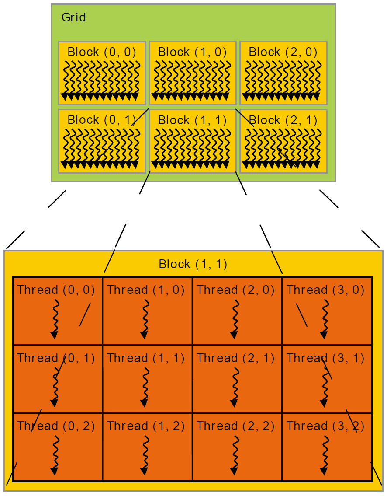
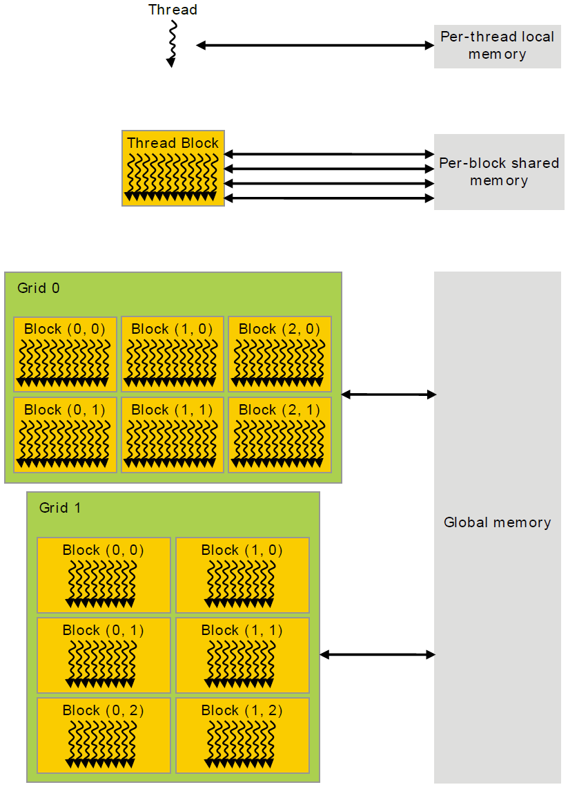

# 2. 编程模型
本章通过C语言的示例，介绍CUDA编程模型的主要概念。更多的关于CUDA C的描述在编程接口章节[link]给出。

本章及下一章中vector addition的完整代码可以在CUDA sample的**vectorAdd**中找到。

# 2.1 Kernels
```
CUDA C extends C by allowing the programmer to define C functions, called kernels,
that, when called, are executed N times in parallel by N different CUDA threads, as
opposed to only once like regular C functions.
```
CUDA扩展了C语言，允许程序员定义C函数，称为Kernel。区别于普通的C函数，kernel被调用的时候，会由N个不同的CUDA thread并行地执行N次。
```
A kernel is defined using the \_\_global\_\_ declaration specifier and the number of
CUDA threads that execute that kernel for a given kernel call is specified using a new
<<<...>>> execution configuration syntax (see C Language Extensions). Each thread
that executes the kernel is given a unique thread ID that is accessible within the kernel
through the built-in threadIdx variable.
```
Kernel通过**\_\_global\_\_**声明符定义。对于给定的kernel调用，通过新引入的执行配置语法**<<<...>>>**进行配置（参考C语言扩展[link]）。执行kernel的每个thread会被分配一个独有的thread ID，可以通过内置变量**threadIdx**在kernel内访问。
```
As an illustration, the following sample code adds two vectors A and B of size N and
stores the result into vector C:
```
作为说明，下面的示例代码实现了两个长度为N的向量A和B相加，并将结果存储到C：

```C
// Kernel 定义
__global__ void VecAdd(float* A, float* B, float* C)
{
int i = threadIdx.x;
C[i] = A[i] + B[i];
}
int main()
{
...
// Kernel 调用使用N个thread
VecAdd<<<1, N>>>(A, B, C);
...
}
```
```
Here, each of the N threads that execute VecAdd() performs one pair-wise addition.
```
这里，执行**VecAdd()**的N个thread每个都执行一次pair-wise的相加。

## 2.2 Thread层次
```
For convenience, threadIdx is a 3-component vector, so that threads can be identified
using a one-dimensional, two-dimensional, or three-dimensional thread index, forming
a one-dimensional, two-dimensional, or three-dimensional block of threads, called a
thread block. This provides a natural way to invoke computation across the elements in a
domain such as a vector, matrix, or volume.
```

为了简便，**threadIdx**是一个含有三个分量的向量，这样thread就能通过一维、二维或者三维的索引标识，从而组成一维、二维或者三维的thread块，称为thread block。这样的设计提供了一种自然地在vector、matrix或者volume的各个元素上执行计算的方式。
```
The index of a thread and its thread ID relate to each other in a straightforward way:
For a one-dimensional block, they are the same; for a two-dimensional block of size (Dx,
Dy),the thread ID of a thread of index (x, y) is (x + y Dx); for a three-dimensional block of size (Dx, Dy, Dz), the thread ID of a thread of index (x, y, z) is (x + y Dx + z Dx Dy).
```
每个thread的索引和它的ID通过直接的方式关联起来：对于一维的block，索引和ID是相同的；对于二维的block，其大小为(Dx,Dy),那么索引为(x,y)的thread对应的thread ID为(x + y Dx)；对于三维的block，其大小为(Dx,Dy,Dz),那么索引为(x,y,z)的thread对应的thread ID为(x + y Dx + z Dx Dy)。
```
As an example, the following code adds two matrices A and B of size NxN and stores the
result into matrix C:
```
下面的示例代码演示了大小为NxN的两个矩阵A和B相加，并将结果存储到矩阵C：
```C
// Kernel 定义
__global__ void MatAdd(float A[N][N], float B[N][N],
float C[N][N])
{
int i = threadIdx.x;
int j = threadIdx.y;
C[i][j] = A[i][j] + B[i][j];
}
int main()
{
...
// Kernel 调用，配置为一个block，这个thread block大小为N * N * 1
int numBlocks = 1;
dim3 threadsPerBlock(N, N);
MatAdd<<<numBlocks, threadsPerBlock>>>(A, B, C);
...
}
```
```
There is a limit to the number of threads per block, since all threads of a block are
expected to reside on the same processor core and must share the limited memory
resources of that core. On current GPUs, a thread block may contain up to 1024 threads.
```
由于thread block内的所有线程需要位于同一个processor core并且共享该core有限的memory资源，所以每个block的thread数是有限制的。在现有的GPU上，一个thread block最多可以包含1024个thread。
```
However, a kernel can be executed by multiple equally-shaped thread blocks, so that the
total number of threads is equal to the number of threads per block times the number of
blocks.
```
然而，一个kernel可以同时由很多个大小设置一样的thread block执行。因此thread的总数等于每个thread block的thread数乘以block的个数。
```
Blocks are organized into a one-dimensional, two-dimensional, or three-dimensional
grid of thread blocks as illustrated by Figure 6. The number of thread blocks in a grid is usually dictated by the size of the data being processed or the number of processors in the system, which it can greatly exceed.
```
Block被组织成一维、二维或者三维的*grid*，如图6所示。一般而言，构成一个grid的thread block数目与需要处理的data的大小或者系统中processor的数目相关(通常来说可以远远超过这个数目,译者注：可以根据processor数目来设定grid内thread block的数目，而不是上限取决于processor数)


图6. Thread block构成grid
```
The number of threads per block and the number of blocks per grid specified in the
<<<...>>> syntax can be of type int or dim3. Two-dimensional blocks or grids can be
specified as in the example above.
```
每个block的thread数目和每个grid的block数目可以在<<<...>>>语法中定义，类型是int或者dim3。二维的block或者grid的定义与上文示例中的类似。
```
Each block within the grid can be identified by a one-dimensional, two-dimensional,
or three-dimensional index accessible within the kernel through the built-in blockIdx
variable. The dimension of the thread block is accessible within the kernel through the
built-in blockDim variable.
```
Grid中的每个block可以通过一维、二维或者三维的索引唯一标识，在kernel中可以通过内置变量**blockIdx**获取。
```
Extending the previous MatAdd() example to handle multiple blocks, the code becomes
as follows.
```
我们将上文**MatAdd()**示例代码进行扩展，使用多个block：
```C
// Kernel 定义
__global__ void MatAdd(float A[N][N], float B[N][N],
float C[N][N])
{
int i = blockIdx.x * blockDim.x + threadIdx.x;
int j = blockIdx.y * blockDim.y + threadIdx.y;
if (i < N && j < N)
C[i][j] = A[i][j] + B[i][j];
}
int main()
{
...
// Kernel 调用
dim3 threadsPerBlock(16, 16);
dim3 numBlocks(N / threadsPerBlock.x, N / threadsPerBlock.y);
MatAdd<<<numBlocks, threadsPerBlock>>>(A, B, C);
...
}
```
```
A thread block size of 16x16 (256 threads), although arbitrary in this case, is a common
choice. The grid is created with enough blocks to have one thread per matrix element
as before. For simplicity, this example assumes that the number of threads per grid in
each dimension is evenly divisible by the number of threads per block in that dimension,
although that need not be the case.
```
Thread block大小设定为16x16（256个thread）是一个常用的配置（尽管在这个示例中是任意的）。通过配置gird容纳足够多的block使得每个矩阵元素都有一个对应的thread。简单起见，这个示例中假定grid中每个维度的thread数目是可以被每个block对应维度的thread数目整除的，尽管这不是必须的。
```
Thread blocks are required to execute independently: It must be possible to execute
them in any order, in parallel or in series. This independence requirement allows thread
blocks to be scheduled in any order across any number of cores as illustrated by Figure
5, enabling programmers to write code that scales with the number of cores.
```
Thread block需要被独立地执行：以任何顺序串行或者并行地执行thread block都应该是可行的。这个独立性要求使得thread block可以按照任何顺序调度并分配在任何数目的core上，如图5所示，这也使得程序员可以编写能够扩展到不同数目的core的代码。
```
Threads within a block can cooperate by sharing data through some shared memory and
by synchronizing their execution to coordinate memory accesses. More precisely, one
can specify synchronization points in the kernel by calling the __syncthreads()
intrinsic function; __syncthreads() acts as a barrier at which all threads in the
block must wait before any is allowed to proceed. Shared Memory gives an example of
using shared memory. In addition to __syncthreads(), the Cooperative Groups API
provides a rich set of thread-synchronization primitives.
```
一个block内的thread可以相互协作，这是通过shared memory共享数据以及同步执行协调memory access来实现的。进一步地来说，我们可以通过在kernel中调用**__syncthreads()**内置函数来定义同步点；**__syncthreads()**设置了一个barrier，block内的所有thread必须在此等待而不能单独地执行下去。Shared Memory[link]给出了一个使用shared memory的示例。除了**__syncthreads()**，Cooperative Groups API[link]还提供了一系列的thread同步原语。
```
For efficient cooperation, the shared memory is expected to be a low-latency memory
near each processor core (much like an L1 cache) and __syncthreads() is expected to
be lightweight.
```
为了实现有限的协作，我们期望shared memory更接近于processor core来获得low latency（更像L1 cache） 以及 **__syncthreads()** 可以是一个轻量级的函数。

## 2.3 Memory层次
```
CUDA threads may access data from multiple memory spaces during their execution
as illustrated by Figure 7. Each thread has private local memory. Each thread block has
shared memory visible to all threads of the block and with the same lifetime as the block. All threads have access to the same global memory.
```
CUDA thread在执行的时候可以从多个memory space访问数据，如图7所示。每个thread有私有的local memory。 每个thread block有shard memory，它对block内的所有thread可见，并且与block有相同的生命周期。所有的thread可以访问相同的global memory。


图7. Memory层次
```
There are also two additional read-only memory spaces accessible by all threads: the
constant and texture memory spaces. The global, constant, and texture memory spaces
are optimized for different memory usages (see Device Memory Accesses). Texture
memory also offers different addressing modes, as well as data filtering, for some
specific data formats (see Texture and Surface Memory).
```
所有thread还能访问另外两种只读memory space：costant memory和texture memory。Global memory，constant memory，texture memory是根据不同memory使用优化的（参见device memory的访问[link]）。此外，texture memory针对某些特殊的数据格式，提供不同的寻址模式和数据滤波（参见Texture和Surface memory[link]）。
```
The global, constant, and texture memory spaces are persistent across kernel launches
by the same application.
```
对于同一个应用程序launch的多个kernel来说，global、constant和texture memory space是持久的。

## 2.4 异构编程
```
As illustrated by Figure 8, the CUDA programming model assumes that the CUDA
threads execute on a physically separate device that operates as a coprocessor to the host running the C program. This is the case, for example, when the kernels execute on a
GPU and the rest of the C program executes on a CPU.
```
根据图8所示，CUDA变成模型假设CUDA threads在一个物理独立的*device*上运行，*host*执行C程序，*device*如同*host*的协处理器。比如举例来说，kernel在GPU上执行，而其余C程序在CPU上执行。


图8. 串行代码在host执行而并行代码在device执行
```
The CUDA programming model also assumes that both the host and the device
maintain their own separate memory spaces in DRAM, referred to as host memory and
device memory, respectively. Therefore, a program manages the global, constant, and
texture memory spaces visible to kernels through calls to the CUDA runtime (described
in Programming Interface). This includes device memory allocation and deallocation as
well as data transfer between host and device memory.
```
同时CUDA编程模型还假设host和device在DRAM中各自维持维护独立的memory space，即对应*host memory*和*device memory*。从而，一个程序管理这对于kernel可见的global、constant和texture memory space，通过调用CUDA runtime（在编程接口章节介绍[link]）。这其中包含了memory分配和释放，以及host和device memory间的数据传输。
```
Unified Memory provides managed memory to bridge the host and device memory
spaces. Managed memory is accessible from all CPUs and GPUs in the system as a
single, coherent memory image with a common address space. This capability enables
oversubscription of device memory and can greatly simplify the task of porting
applications by eliminating the need to explicitly mirror data on host and device. See
Unified Memory Programming for an introduction to Unified Memory.”
```
Unified memory提供了一种*managed memory*用于建立host和device memory space间的联系。Managed memory是一种拥有通用寻址空间的单一一致的memory image，可以从系统中的所有CPU和GPU上访问到。这种能力使得注册超过device memory物理大小的memory space成为可能，从而尅避免显式地创建host和device间的数据镜像，极大地简化了应用的移植。关于Unified memory的介绍可以参见Unified memory编程章节[link]。

## 2.5 计算能力
```
The compute capability of a device is represented by a version number, also sometimes
called its "SM version". This version number identifies the features supported by the
GPU hardware and is used by applications at runtime to determine which hardware
features and/or instructions are available on the present GPU.
```
Device的*Compute capability*（计算能力）是通过一个版本号表示的，有的时候也称为SM版本。这个版本号标识了GPU硬件支持的特性，同时也用于runtime阶段的应用确定哪些硬件特性或者指令在当前GPU是可用的。
```
The compute capability comprises a major revision number X and a minor revision
number Y and is denoted by X.Y.
```
计算能力由主版本号*X*和次版本号*Y*组成，记作*X.Y*。
```
Devices with the same major revision number are of the same core architecture. The
major revision number is 7 for devices based on the Volta architecture, 6 for devices
based on the Pascal architecture, 5 for devices based on the Maxwell architecture, 3 for
devices based on the Kepler architecture, 2 for devices based on the Fermi architecture,
and 1 for devices based on the Tesla architecture.
```
拥有相同主版本号X的device有相同的核心架构。对于Volta架构来说，X是7；Pascal架构对应的X是6；Maxwell架构对应的X是5；Kepler架构对应的X是3；Fermi架构的X为2；而Tesla架构对应的X为1（译者注：注意区别于Tesla系列GPU，此处Tesla指的是核心架构）。
```
The minor revision number corresponds to an incremental improvement to the core
architecture, possibly including new features.
```
次版本号对应于核心架构的增量改进，也可能会引入一些新的特性。
```
CUDA-Enabled GPUs lists of all CUDA-enabled devices along with their compute
capability. Compute Capabilities gives the technical specifications of each compute
capability.
```
CUDA-Enabled GPU[link]章节列出了所有可以使用Cuda的device以及对应的计算能力。计算能力章节[link]给出了不同计算能力对应的技术规范。
```
The compute capability version of a particular GPU should not be confused with the
CUDA version (e.g., CUDA 7.5, CUDA 8, CUDA 9), which is the version of the CUDA
software platform. The CUDA platform is used by application developers to create
applications that run on many generations of GPU architectures, including future
GPU architectures yet to be invented. While new versions of the CUDA platform often
add native support for a new GPU architecture by supporting the compute capability
version of that architecture, new versions of the CUDA platform typically also include
software features that are independent of hardware generation.
```
```
不要将一个GPU的计算能力的版本与CUDA版本（比如说CUDA 7.5，CUDA 8，CUDA 9）混淆起来，后者是CUDA软件平台的版本。CUDA平台用于应用开发者创建可以运行在不同的GPU架构上的应用，包括现在还没有定义的未来的架构。新版本的CUDA平台通常会通过支持对应新架构的SM版本号来为一些新的GPU架构提供原生的支持。新版本的CUDA一般来说也会提供一些独立于硬件迭代的软件上的特性。
```
```
The Tesla and Fermi architectures are no longer supported starting with CUDA 7.0 and
CUDA 9.0, respectively.
```
*Tesla*和*Fermi*架构分别从CUDA 7.0和CUDA 9.0开始不再被支持。